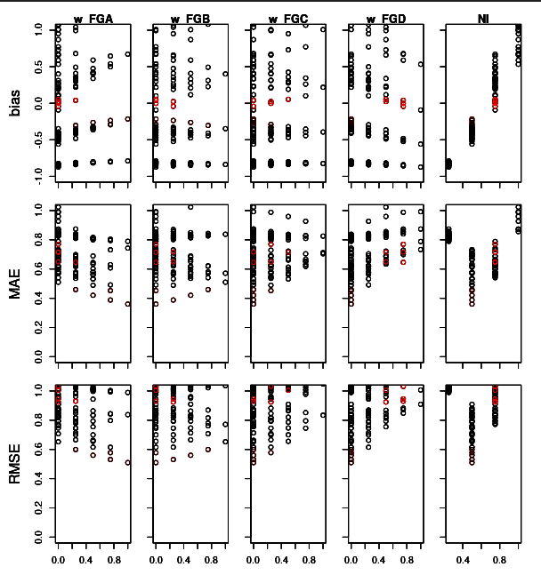

```{r, include = FALSE}
knitr::opts_chunk$set(
  collapse = TRUE,
  comment = "#>",
  fig.height = 6,
  fig.width = 8
)
```

This vignette outlines the tools provided by `growR` for model calibration.
It focuses on the practical aspects of which functions to call when.
For an in-depth discussion about the calibration procedure as a whole, see 
[the respective article](https://github.com/kuadrat/growR/tree/master/vignettes/figs/calibration_in_depth.pdf){target="_blank"}.

## Prerequisites

We cannot calibrate anything without some reference data for which we want to 
identify ideal model parameters.
For the purpose of this tutorial, we are going to make use of the example 
data provided with the package.
If you use your own data, be sure that it adheres to the data file format as 
outlined in `load_measured_data()`.

Furthermore, we need everything that's also required to run a simulation: 
weather input, a parameter file and, optionally, management data.
Confer [the introductory tutorial](growR.html) for details.
Again, we are going to use the example data here (though you can feel free to 
use your own).
We'll use the same setup as [in the introductory tutorial](growR.html):

```{r, include = FALSE}
# Store the original wd
original_dir = getwd()
```

```{r tempdir}
working_dir = file.path(tempdir(), "growR_calibration_tutorial")
dir.create(working_dir)
setwd(working_dir)
library(growR)
setup_directory(working_dir, force = TRUE)
```

```{r, include = FALSE}
# knitr resets working dir to root.dir after every chunk.
# This makes sure we stay in working_dir
knitr::opts_knit$set(
  root.dir = working_dir
)
```

We will also already load the example configuration.
For the sake of saving on computation time in this example, we limit the 
simulation to just one year.
In a real-world situation, you should of course make use of all the 
calibration data available to you!

```{r prepare_env}
envs = read_config("example_config.txt")
# We only need one run environment.
env = envs[[1]]
# Save compuation time by considering only one year
env$years = env$years[1]
```

## The parameter scan loop

The essential approach to finding optimized parameters for a given site is to 
run and evaluate the model for many different sets of parameters.
By comparing their performance scores, we can hone in on those parameter 
combinations that are promising.
We then evaluate the model with more parameter sets, now in the regions of 
parameter space where we suspect good performace.
We can keep doing this until we do not seem to find better parameter sets 
anymore or until we are satisfied (see [the in-depth 
article](https://github.com/kuadrat/growR/tree/master/vignettes/figs/calibration_in_depth.pdf){target="_blank"} for a much more detailed 
description).

The three functions that facilitate this iterative procedure are 
`run_parameter_scan()`, `analyze_parameter_scan()` and `plot_parameter_scan()`.
The first makes it easy to carry out model runs for many different parameter 
sets.
`analyze_parameter_scan()` then takes the output of these model runs and 
compares them to a set of reference data to assign performance scores to each run.
Finally, `plot_parameter_scan()` visualizes these performance scores as a 
function of input parameters and thus helps identify *good* regions in 
parameter space.

### Running a parameter scan

We can define the parameter values of interest as input to 
`run_parameter_scan()`.
The function will then automatically generate all possible, valid 
combinations of parameters and run the model in a given configuration for 
each of these parameter combinations.
Given that even for relatively small parameter ranges we can end up with a 
number of combinations in the order of 100, this step can become quite 
calculation intensive.

Initially, if we have absolutely no prior knowledge about the parameters, we 
have to consider all parameters across their full possible ranges.
An input for `run_parameter_scan()` might thus look like this:

```
param_values = list(w_FGA = seq(0, 1, 0.25),
                    w_FGB = seq(0, 1, 0.25),
                    w_FGC = seq(0, 1, 0.25),
                    w_FGD = seq(0, 1, 0.25),
                    NI = seq(0.25, 1, 0.25))
```

Be sure to read the documentation of `run_parameter_scan()` and the more 
detailed descriptions in `create_combinations()` regarding sensible 
construction of `param_values`.

We are now ready to go:

```
pscan_results = run_parameter_scan(env, param_values, 
                                   outfilename = "pscan_results0.rds")
```

This might take some time to run and will store the results in a binary 
format in `"pscan_results0.rds"` as well as in the variable `pscan_results`.

### Analyzing a parameter scan

In order to evaluate the model outputs, we need to compare them to some 
reference data.
In our current setup, we know that the corresponding data is stored under 
`data/`.

```{r analyze_pscan}
# Prepare path to reference data
site = env$site_name
print(site)
datafile = file.path("data", sprintf("%s.csv", site))
```

Instead of specifying the path we could also have loaded the data and passed 
the data.frame as an argument to `analyze_parameter_scan()`.
Similarly, we can use the path to the binary file created by our previous 
call to `run_parameter_scan()` *or* just the stored object in the variable.

```
# Analyze!
analyzed = analyze_parameter_scan(pscan_results, datafile)
```

This shouldn't take long to compute.
You can have a look at the output data.frame and see how well different 
combinations perform:

```
analyzed$results
```

A much more intuitive way, however, is to visualize these results:

```
plot_parameter_scan(analyzed)
```

This should create a plot similar to the following:


We have a subplot for each combination of scanned parameter and used metric 
(bias, mean absolute error MAE and root of mean-squared error RMSE).
In each subplot, we have a point for every evaluated parameter combination.

`plot_parameter_scan()` puts you into a small interactive command line 
interface (CLI), which allows you to highlight different parameter 
combinations in the plot and display their numeric values on the console.
Refer to the on-line help (`?`) for more on how to use this little tool.

From this plot we can already make out some trends:

  1. (top right plot) NI clearly correlates with bias.
  2. (same plot) NI values of 0.9 or 0.3 fail to produce *good* (i.e. close 
     to 0) bias.
  3. (NI column, bottom two rows) Similarly, NI values 0.3 and 0.9 lead to 
     large MAE and RMSE.

From this we can pin down the ranges of plausible NI values to larger than 
0.3 and smaller than 0.9.

  4. (w_FGC and w_FGD columns) Parameter combinations with low amounts of C 
     and D clearly score better than those with large C or D.
  5. (w_FGD column) The same can be said about B, but the effect is less 
     extreme.
  6. (w_FGA column) The opposite trend is visible for A.

From this we could for example narrow down w_FGA to be larger than 0.3, B to 
be no greater than 0.8 and C and D to be smaller than 0.5.

We can now do a new parameter scan with updated *param_values*, e.g.
```
param_values = list(w_FGA = seq(0.3, 1, 0.1),
                    w_FGB = seq(0, 0.7, 0.1),
                    w_FGC = seq(0, 0.3, 0.1),
                    w_FGD = seq(0, 0.3, 0.1),
                    NI = seq(0.5, 0.7, 0.05))
```
Since we have narrowed down the ranges, we can afford to increase the 
*resolution*, i.e. decrease the step size for the parameters.
Keep iterating this process until you've narrowed down the parameter ranges 
to a degree that is acceptable for you.

The exact choice of which parameters ranges to examine is, of course, up to 
you and might require some experimentation.
It might, for example, make sense to keep the functional group weights 
unconstrained and first pin down NI.
In other situations you might be able to make use of some prior knowledge, 
e.g. a measurement of the plant composition, which gives you a hint towards 
which functional groups should be prevalent.
Refer to [the in-depth guide](https://github.com/kuadrat/growR/tree/master/vignettes/figs/calibration_in_depth.pdf){target="_blank"} for a 
more rigorous discussion.

```{r, include = FALSE}
# Clean up
knitr::opts_knit$set(
  root.dir = original_dir
)
setwd(original_dir)
#unlink(working_dir, recursive = TRUE)
```

